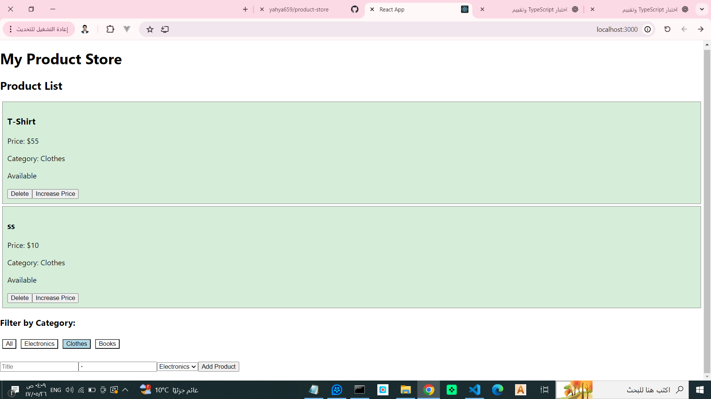

# 🔥 وصف المشروع
**متجر المنتجات** هو تطبيق **React + TypeScript** حديث وآمن من ناحية الأنواع (Type-safe).  
يسمح للمستخدمين **بإضافة، تعديل، حذف، وتصفية المنتجات** مع ضمان التوافق الكامل مع أنواع TypeScript.  

مثالي للاستخدام في **محفظة أعمالك (Portfolio)** أو **طلبات التوظيف** كمطور واجهات أمامية.

---

## ⚡ المميزات

- **عمليات CRUD كاملة:** إضافة، تعديل، وحذف المنتجات بشكل ديناميكي.  
- **تصفية حسب الفئة:** فلترة المنتجات حسب الإلكترونيات، الملابس، أو الكتب.  
- **قوة TypeScript:** 
  - الواجهات (Interfaces) والأنواع (Types)  
  - Literal Types  
  - `Partial` و `Readonly`  
  - Conditional Types  
  - Generics  
  - Type Guards  
  - `keyof`  
- **واجهة مستخدم بسيطة وجذابة:** ألوان مختلفة حسب حالة المنتج (متاح / غير متاح).  
- **بدون خادم Backend:** يعمل على بيانات JSON وهمية.

---

## 🎨 صورة المشروع



---

## 🛠️ التقنيات المستخدمة

- **React 18**
- **TypeScript 5**
- CSS / تنسيق بسيط
- **بدون Backend / بيانات وهمية**

---

## 🚀 طريقة التشغيل

### نسخ المشروع
```bash
git clone https://github.com/Yahya659/product-store-ts.git
cd product-store-ts